# SecondTrade
二手交易平台，校园二手书籍交易，社区二手交易平台，基于SpringBoot的二手商城系统，毕业设计

### 完整项目获取

通过网盘分享的文件：二手交易系统

链接: https://pan.baidu.com/s/1obpNDaV_2N56q-u2Ey_pHg?pwd=iik6 提取码: iik6
--来自百度网盘超级会员v3的分享

### 项目合集(项目不断更新中，包含java、vue、python、Android、微信小程序等项目)

链接: https://pan.baidu.com/s/1nY-zhvAK0CXYcn3g7LzQnQ?pwd=id3c 提取码: id3c
--来自百度网盘超级会员v3的分享

### 工具包

链接: https://pan.baidu.com/s/1YmdoJvkjoUjA75wvHLDZ6A?pwd=xm96 提取码: xm96
--来自百度网盘超级会员v3的分享

需要远程项目部署或项目修改和毕业设计也可联系（添加申请时请备注好来意）

### 远程调试部署联系方式

链接: https://pan.baidu.com/s/1W0dDcoZmayG0c7USJDYBYg?pwd=nqd7 提取码: nqd7
--来自百度网盘超级会员v3的分享

#### 这些项目一起发你了 可以分享给你需要的同学 调试可找我 也接二次修改和项目定制、毕业设计等

### 扫码关注公众号 获取更多项目和编程资料

关注公众号：小猿天天学习

公众号ID：xzzard

## 接毕业设计和论文

微信联系方式：xzxj0206  QQ：3808981644   (支持修改、 部署调试、 支持代做毕设)

接网站建设、小程序、H5、APP、各种系统等，单片机、嵌入式也可以做

选题+开题报告+任务书+程序定制+安装调试+论文+答辩ppt  都可以做

## 一、项目介绍

语言: Java  数据库:MySQL

后端技术：SpringBoot、Mybatisplus

前端技术：Vue、ElementUI

本系统包含用户和管理员两个角色

用户：登录、注册、物品发布、消息模块、物品购买模块、收藏模块、下架模块、售出模块、购买模块、个人中心等。

管理员：登录、用户信息管理、商品信息管理、订单信息管理等

## 二、系统运行界面

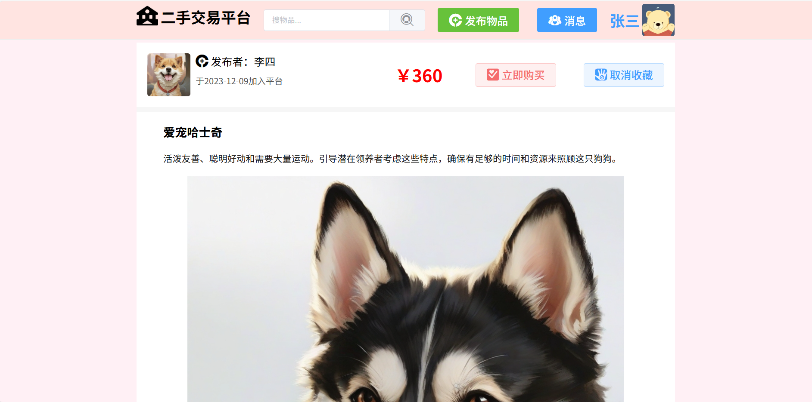

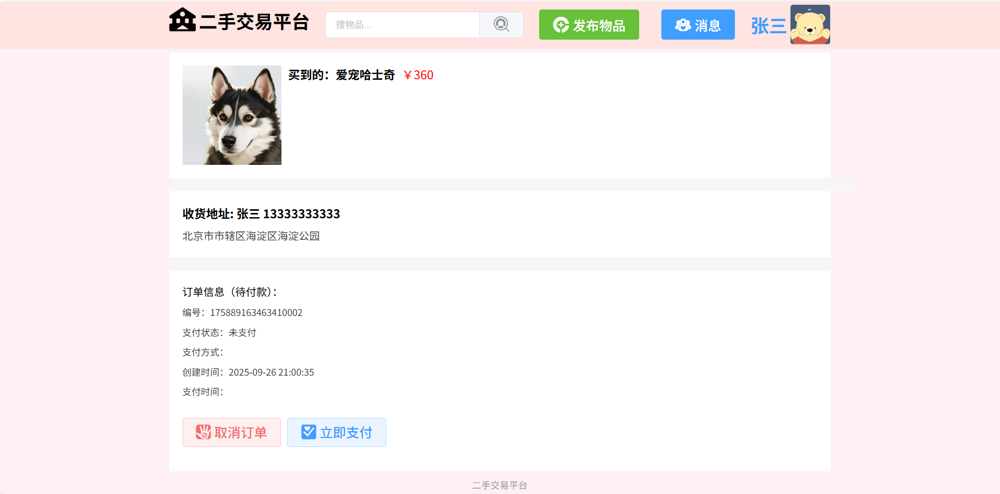

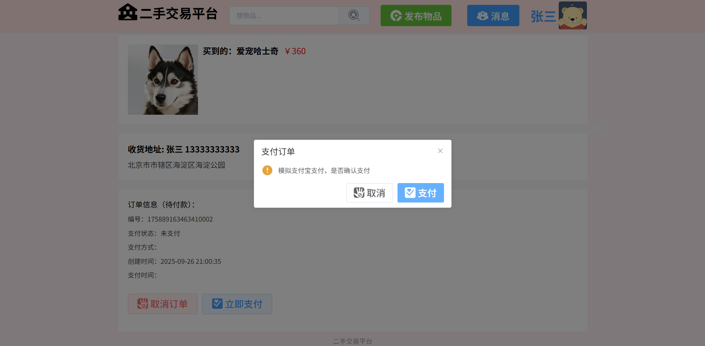

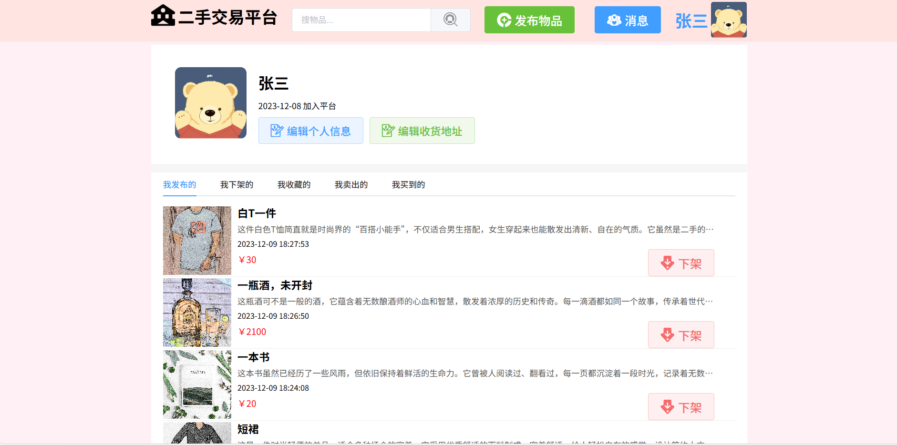

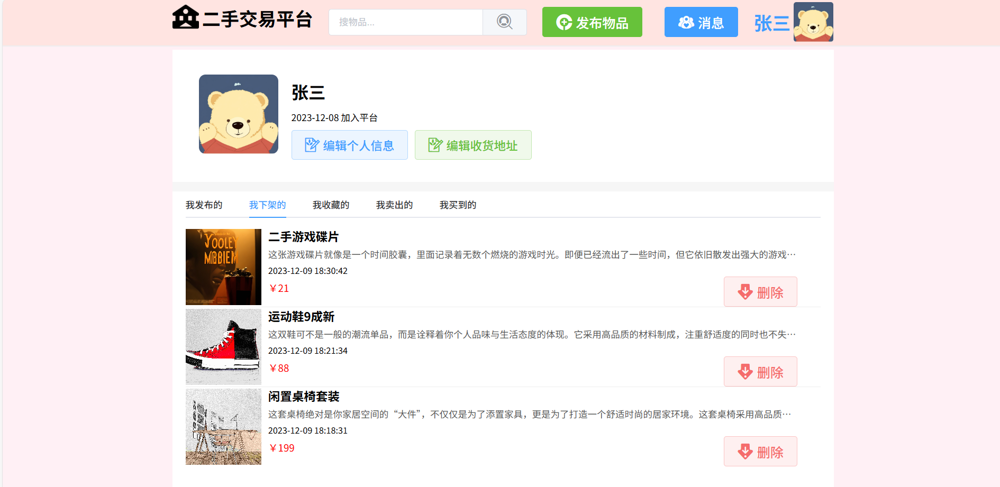

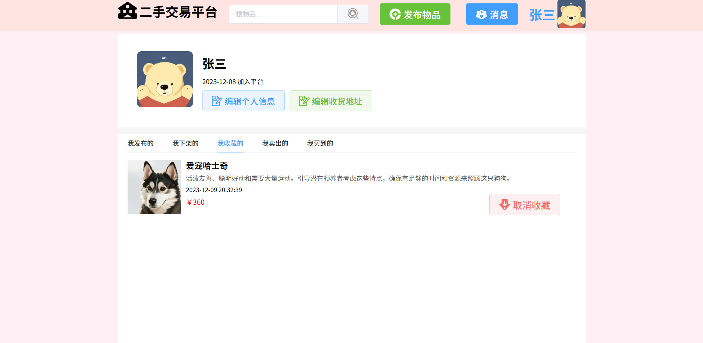

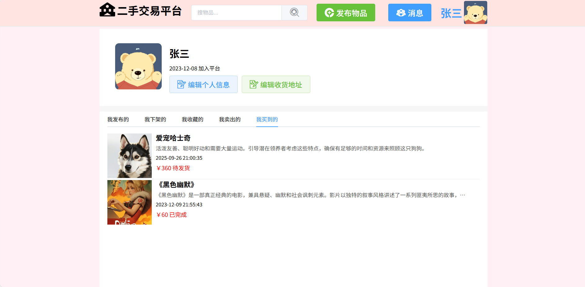

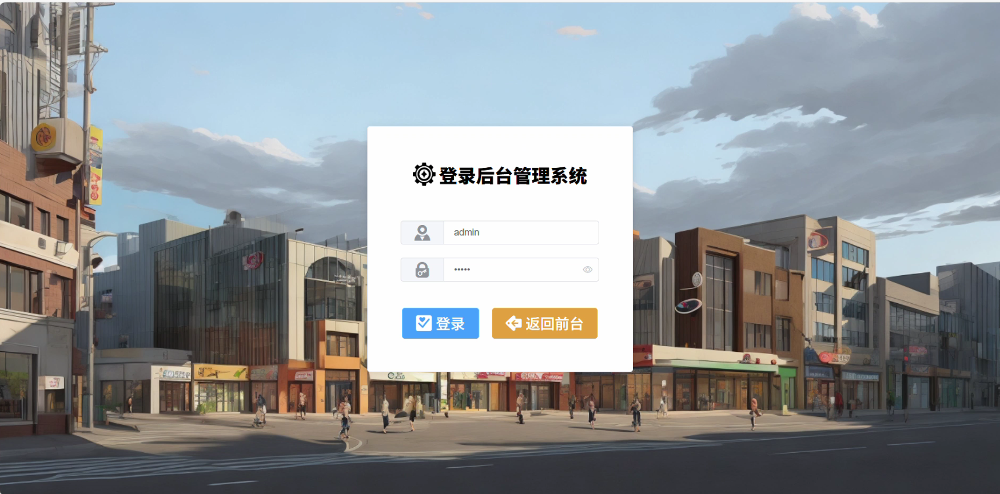

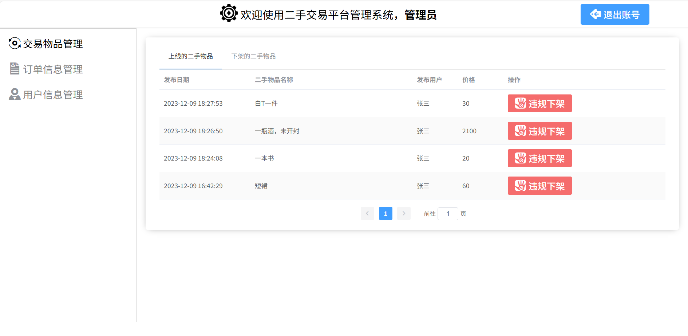

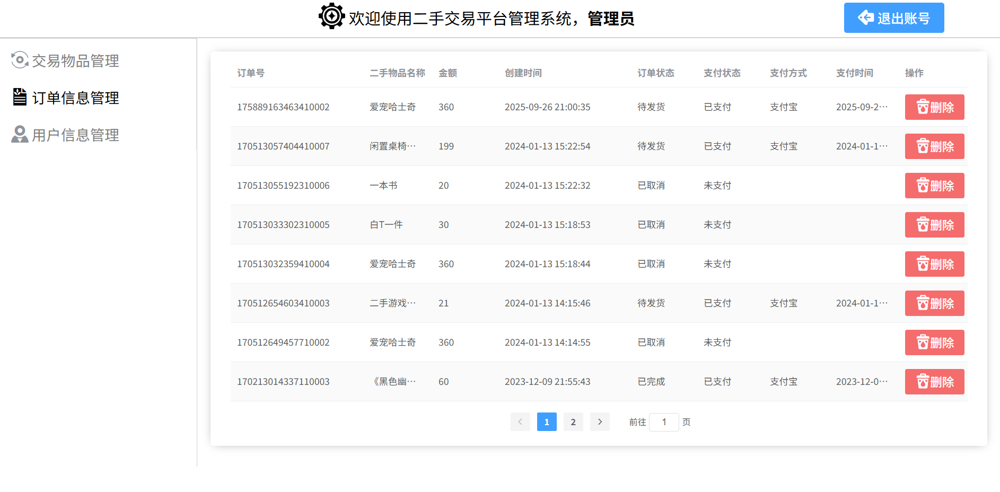

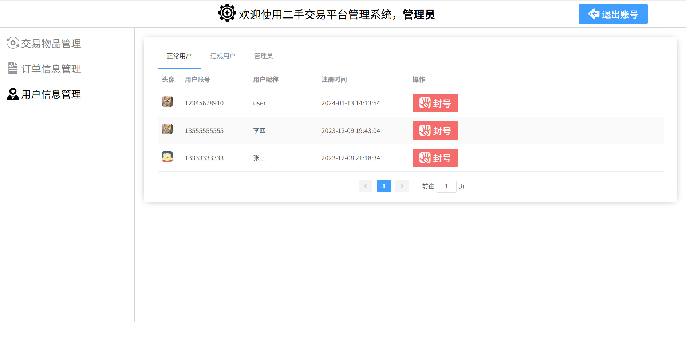

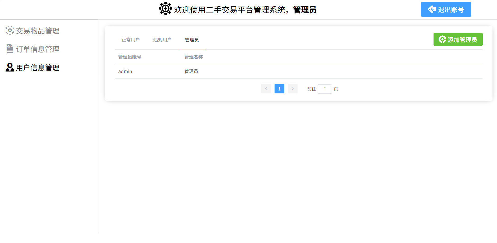

